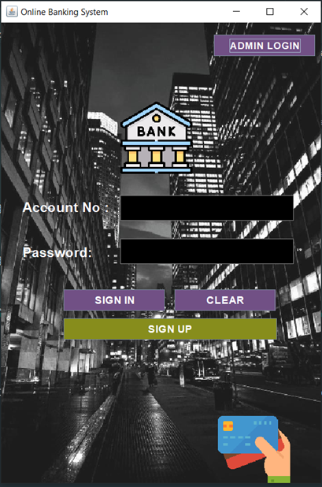
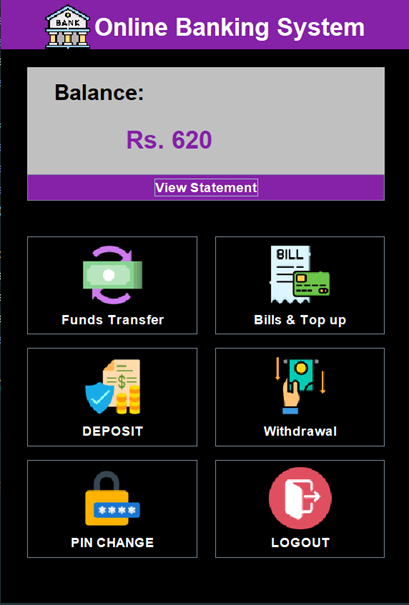
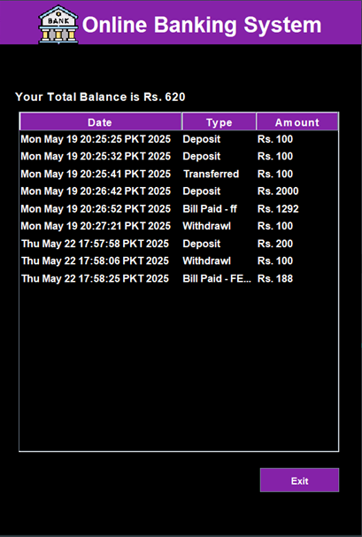
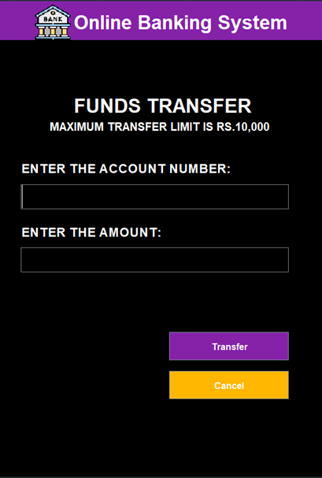
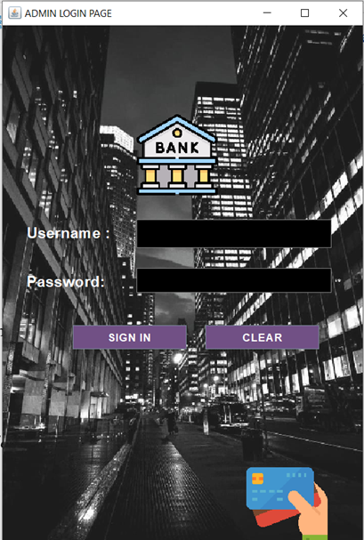
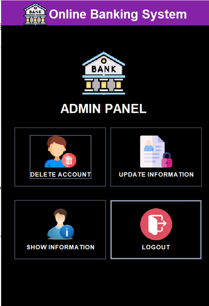

# Online Banking System

A desktop banking application built with **Java Swing** and **MySQL**. It provides a simple interface for customers to open and manage an account, perform common banking operations, and review their transaction history. A separate admin panel supports customer record management.

> This is an educational project created to demonstrate Java GUI programming, JDBC database connectivity, and CRUD operations. It is not intended for production banking use.

## Features

### Customer portal

- Multi-step account registration with personal, additional, and account details
- Secure-style sign-in using account number and PIN
- Live balance calculation from transaction records
- Deposit and withdrawal operations
- Fund transfers between registered accounts
- Bill payment / top-up workflow
- PIN change
- Transaction history (mini statement)
- Logout confirmation

### Admin portal

- Admin login screen
- View registered customer information
- Update customer name, email, address, and PIN
- Delete an account and its related transaction records

## Screenshots

### Customer experience

<p align="center">
  
  
</p>

<p align="center"><em>Customer login and account dashboard</em></p>

<p align="center">
  
  
</p>

<p align="center"><em>Transaction history and funds transfer</em></p>

### Admin experience

<p align="center">
  
  
</p>

<p align="center"><em>Admin login and account-management dashboard</em></p>

## Tech Stack

- **Language:** Java
- **Desktop UI:** Java Swing
- **Database:** MySQL
- **Database access:** JDBC / MySQL Connector/J
- **Date picker:** JCalendar
- **IDE project format:** IntelliJ IDEA

## Project Structure

```text
.
├── database.sql                       # MySQL schema and initial admin record
├── mysql-connector-j-9.3.0.jar       # MySQL JDBC driver
├── jcalendar-tz-1.3.3-4.jar          # JCalendar dependency
├── src/
│   ├── BankManagementSystem/
│   │   ├── Login.java                # Application entry point and customer login
│   │   ├── Signup.java               # Registration: personal details
│   │   ├── Signup2.java              # Registration: additional details
│   │   ├── Signup3.java              # Registration: account details
│   │   ├── main_Class.java           # Customer dashboard
│   │   ├── Deposit.java, Withdrawl.java, transfer.java
│   │   ├── fastCash.java             # Bills and top-up payment screen
│   │   ├── mini.java                 # Transaction statement
│   │   ├── Pin.java                  # PIN change screen
│   │   └── admin*.java, update.java, delete.java, showInfo.java
│   └── icon/                         # UI images and backgrounds
└── out/                              # Compiled output (generated by the IDE/build)
```

## Prerequisites

Before running the project, install:

- Java JDK 8 or later
- MySQL Server 8 or later
- IntelliJ IDEA (recommended) or another Java IDE

The repository already contains the MySQL Connector/J and JCalendar JAR files required by the project.

## Database Setup

1. Start your MySQL server.
2. Open a MySQL client, such as MySQL Workbench or the MySQL command line.
3. Run the [`database.sql`](database.sql) script from the project root. It creates the `banksystem` database and the required tables:
   - `signup`, `signup2`, and `signup3` for registration details
   - `login` for customer credentials
   - `bank` for transaction records
   - `admin_login` for the seeded admin record
4. Update the connection settings in [`conn.java`](src/BankManagementSystem/conn.java) if your MySQL username, password, port, or host differs from the local defaults.

Current connection format:

```java
DriverManager.getConnection(
    "jdbc:mysql://localhost:3306/banksystem",
    "root",
    "YOUR_MYSQL_PASSWORD"
);
```

> The provided source currently contains a local development password. Change it before sharing or deploying the project.

## Run the Application

### IntelliJ IDEA

1. Open the project in IntelliJ IDEA.
2. Ensure both JAR files in the project root are included in the project dependencies.
3. Make sure `src` is marked as a **Sources Root** and the `icon` folder is available on the runtime classpath.
4. Run [`Login.java`](src/BankManagementSystem/Login.java).

### Command line (PowerShell)

From the project root, compile the source files:

```powershell
javac -cp "mysql-connector-j-9.3.0.jar;jcalendar-tz-1.3.3-4.jar" -d out/production/OnlineBankingSystem src/BankManagementSystem/*.java
```

Copy the image resources to the compiled output folder:

```powershell
Copy-Item src/icon out/production/OnlineBankingSystem -Recurse -Force
```

Then run the customer login screen:

```powershell
java -cp "out/production/OnlineBankingSystem;mysql-connector-j-9.3.0.jar;jcalendar-tz-1.3.3-4.jar" BankManagementSystem.Login
```

## How to Use

1. Launch the application from `Login.java`.
2. Select **Sign Up** and complete all three registration forms to create a customer account.
3. Save the generated account number and PIN shown after registration.
4. Sign in with the account number and PIN.
5. Use the dashboard to deposit funds, withdraw cash, pay bills, transfer funds, change your PIN, or view your statement.
6. Select **Admin Login** from the customer login screen to access account management tools.

## Demo Credentials

The current admin screen uses the following hard-coded development credentials:

```text
Username: admin
Password: hamza
```

For security, replace these credentials and move authentication to the database before using the project outside a local demo environment.

## Database Design

The application separates customer registration into three related tables, linked through `form_no`. The `login` table stores the account number and PIN required for sign-in. Every financial operation creates a row in the `bank` table; the current balance is calculated by adding deposits and subtracting outgoing transactions.

## Future Improvements

- Store passwords and PINs securely using hashing rather than plain text.
- Use prepared statements to protect database queries from SQL injection.
- Move database credentials to environment variables or a configuration file excluded from Git.
- Add input validation for all amounts, account numbers, and registration fields.
- Add automated tests and a Maven or Gradle build configuration.
- Add transaction handling so transfers are completed atomically.
- Replace hard-coded admin authentication with database-backed, role-based access control.

## Author

Created as a Java academic project.
Hamza Mustafa
BSCS National Univeristy Of Modern Languages Faisalabad Campus

## License

This project is for educational use. Add a license file (for example, MIT) if you want to define how others may use or modify it.
